# QRCraft

QRCraft is a modern, feature-rich QR code utility app for Android, built with the latest technologies including Jetpack Compose, CameraX, ML Kit Barcode Scanning, and Koin.

>[!IMPORTANT]
>This project was developed for the **Mobile Dev Campus**, focusing on industry-standard Clean Architecture and modern Android development practices.

## ✨ Features

- **Scan QR Codes**: Quickly and accurately scan QR codes and barcodes using the device's camera or by picking an image from the gallery.
- **Generate QR Codes**: Create custom QR codes for various types of content such as URLs, text, and more.
- **History & Favorites**: Automatically keep track of scanned and generated QR codes. Easily mark items as favorites for quick access.
- **Save & Share**: Save generated or scanned QR codes to your device storage or share them directly with others.
- **Modern UI**: A beautiful, responsive, and intuitive interface designed with Jetpack Compose Material 3.

## 🛠 Tech Stack

The project leverages a modern Android tech stack:

- **Language**: [Kotlin](https://kotlinlang.org/)
- **UI Framework**: [Jetpack Compose](https://developer.android.com/jetpack/compose) (Material 3)
- **Dependency Injection**: [Koin](https://insert-koin.io/)
- **Database**: [Room](https://developer.android.com/training/data-storage/room)
- **Camera Provider**: [CameraX](https://developer.android.com/training/camerax)
- **Barcode Scanning**: [ML Kit Barcode Scanning](https://developers.google.com/ml-kit/vision/barcode-scanning)
- **QR Code Generation**: QRose
- **Navigation**: [Navigation Compose](https://developer.android.com/guide/navigation/navigation-compose)
- **Permissions**: [Accompanist Permissions](https://google.github.io/accompanist/permissions/)
- **Architecture**: Clean Architecture (Presentation, Domain, Data) with MVI pattern.

## 🏗 Architecture

This app follows **Clean Architecture** principles to ensure separation of concerns and testability:

- **Presentation Layer**: Contains UI components (Compose), ViewModels, and UI State/Events.
- **Domain Layer**: Repository interfaces. Pure Kotlin, no Android dependencies.
- **Data Layer**: Contains Repository implementations, Data Sources (Room, Preferences), and Mappers.

## 🚀 Setup & Installation

**Clone the repository**:
   ```bash
   git clone https://github.com/encorex32268/QRCraft.git
   ```

## 📸 Screenshots

| Scan QR Code | Generate Options | Create Link |
|:---:|:---:|:---:|
| 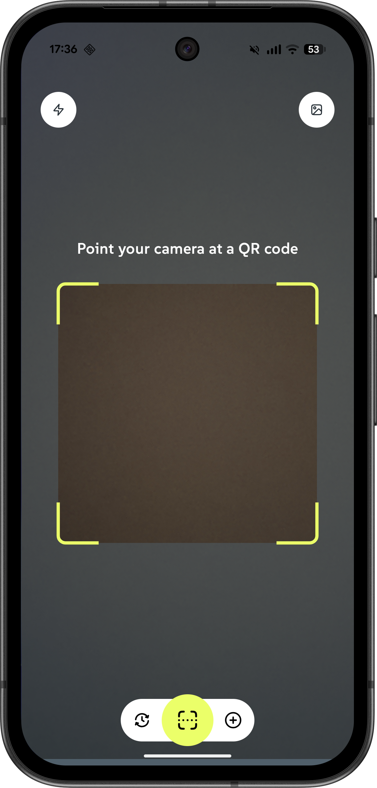 | 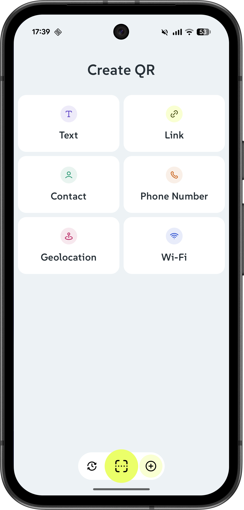 | 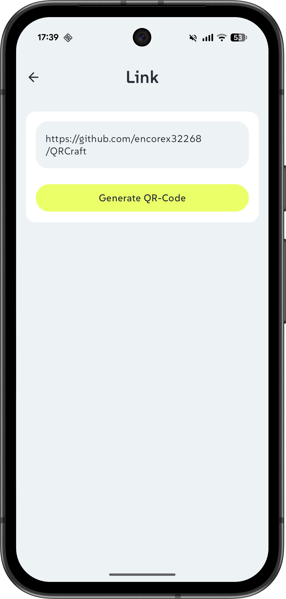 |

| Created QR Code | Edit Details | History |
|:---:|:---:|:---:|
| 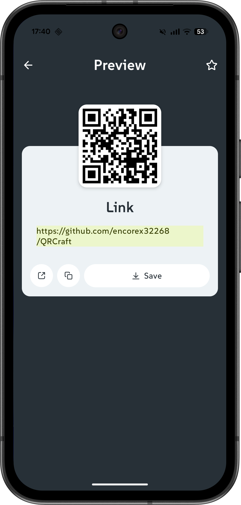 | 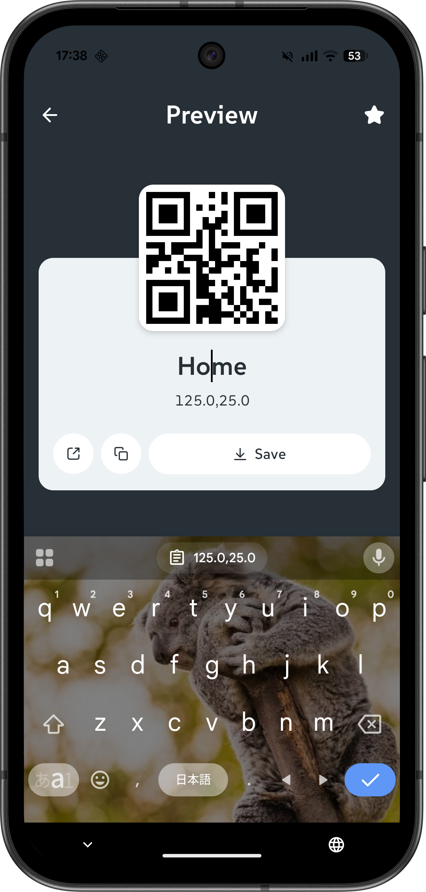 | 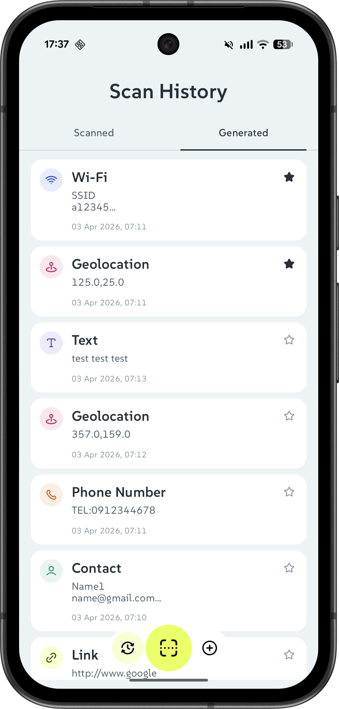 |

| Favorite Preview | Pick Image | QR Code Save |
|:---:|:---:|:---:|
| 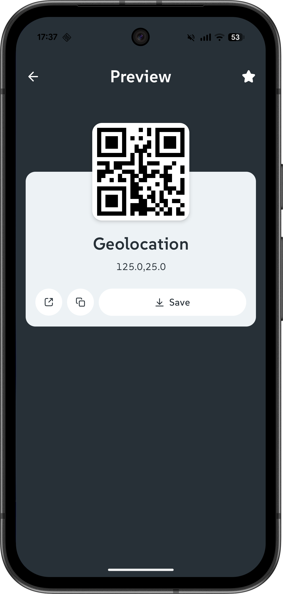 | 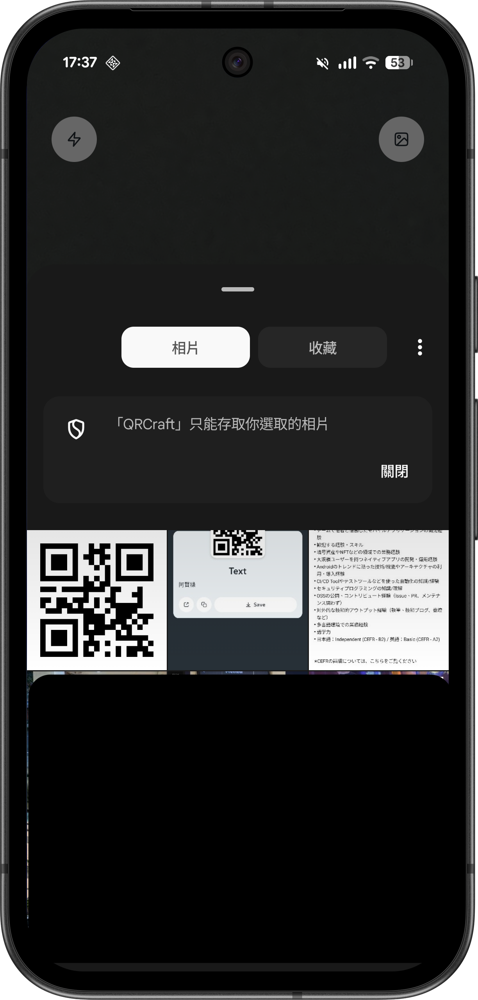 | 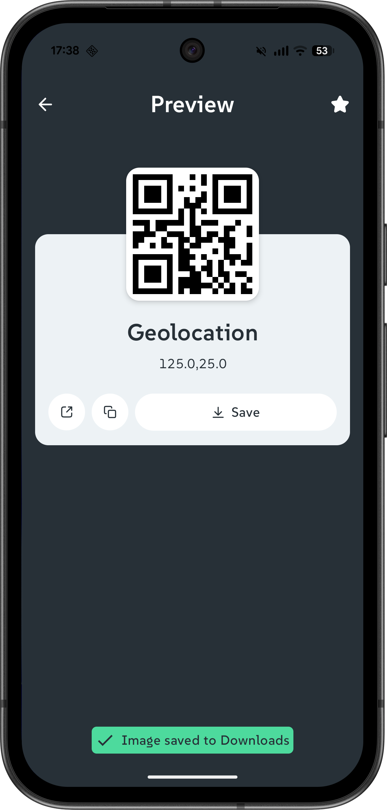 |

| Preview Copy | Preview Share |
|:---:|:---:|
| 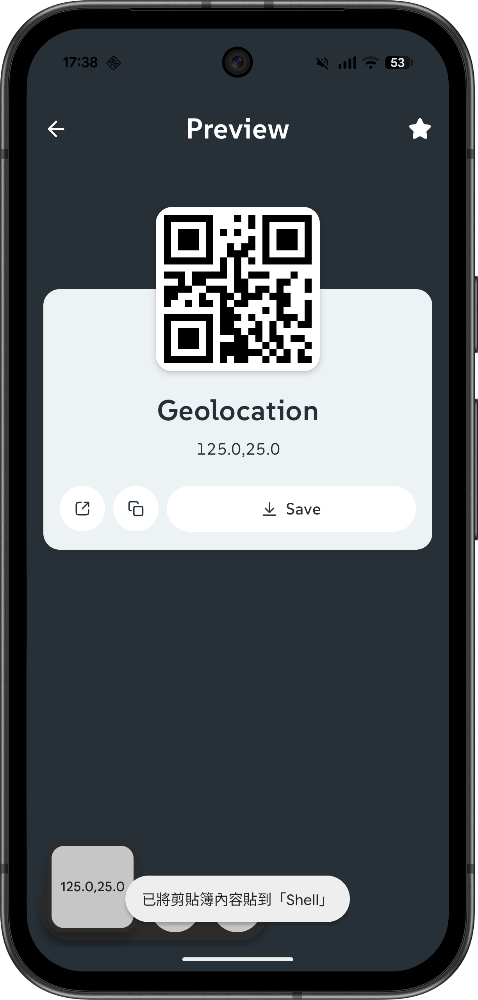 | 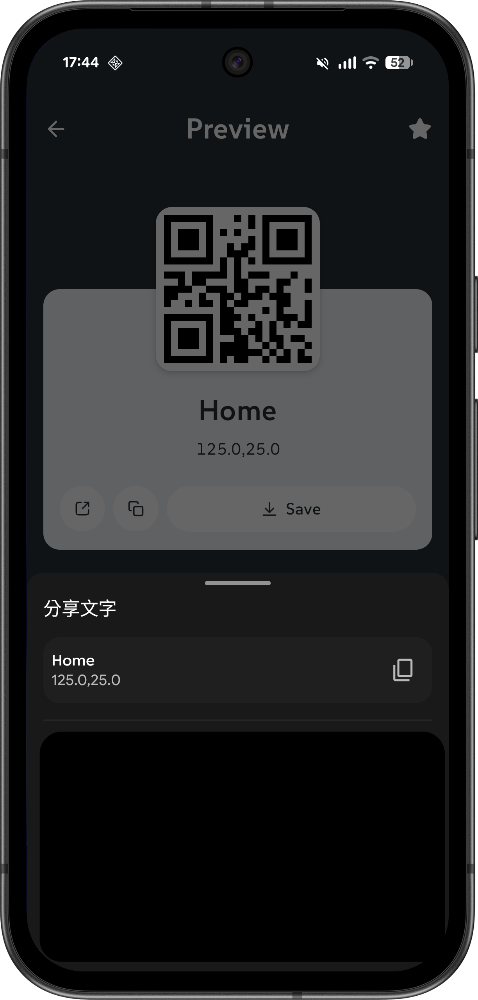 |

## 📜 License

This project is open source.

**Author**: [LiHan](https://github.com/encorex32268)

**Project Link**: [QRCraft](https://github.com/encorex32268/QRCraft)

## 🚀 Future Roadmap
- **Custom QR Code Styling**: Add options to customize QR code colors, logos, and shapes.
- **More QR Code Formats**: Support generation for WiFi, vCard, Email, and SMS formats.
- **Unit & UI Testing**: Increase code coverage with **Room database tests** and **Compose UI tests** to ensure app stability and reliability.
